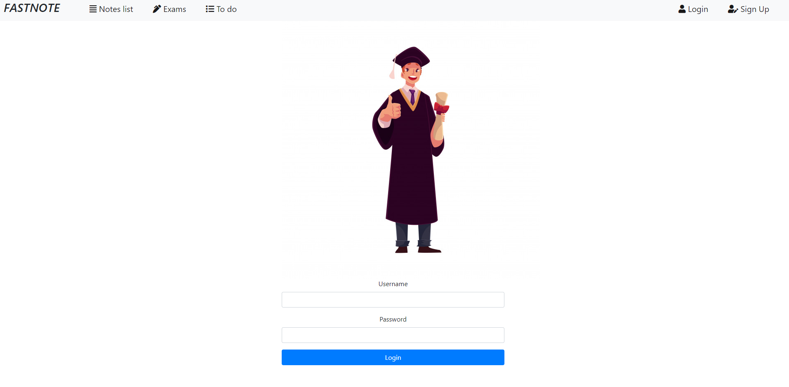

App to create notes
==========
The main target of this app is creating notes as cutting parts from e.g. online lessons
Not every time we can copy text to note, or we want to remember some graph what teacher
shows as. 
I'm build this app because I'm doing a lot of photos during online classes.
And I had big messed.

Frontend:
https://github.com/PiraMIID/notes-fronend

default user is 
- username: dawid
- password: szmajduch

if you want change this look to Start class

## Spring Security: JWT
- config is set in config.SecurityConfig class
- jwt is holding in localstorage by browse
- settings of jwt in application-jwt.properties

##Spring data
- data base: postgerSQL
- settings in application.properties
- fake data adding in Start class

## Images

#mail to confirm account

